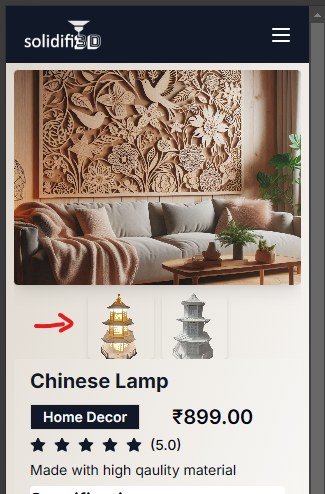
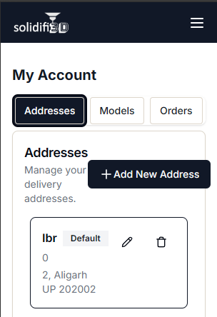

# Site Review

## solidifi3d.com

---

This document uses a mobile-first approach. This means that issues related to smaller screen sizes are mentioned first. The smallest screen width is 320px and the largest is 1440px.

### 1. Landing Page

[https://solidifi3d.com/](https://solidifi3d.com/)

#### 1.1 Design

1. Horizontally align the popup with the image.
2. Give some vertical space between the popup and the image.
3. Text "Dream Now" must not wrap to the next line.
4. Contast between the white arrow and the white part of the gradient is not enough. The arrow is barely visible. Suggestion: Use a darker background gradient.
5. Grammar: "3D Model of a Villa on a Transparent Background".

1. The close menu button is barely visible. Consider making it white.

1. Fix text wrapping in the button.

1. The list should be vertically aligned with the heading "Our Services".
2. Fix text wrapping.

1. Horizontal alignment.
2. Horizontal alignment.

*Screen width: 383px to 1023px*

Hero Section must be center aligned. (Considering the popup, image, and the CTA button as the hero section).

*Screen width: 1024px*

1. Fix text wrapping in the buttons.
2. The font size of the heading "Dream. Design. Deliver." can be larger.

1. Text wrapping.
2. Either stretch the image to take up the full height of the container or center align horizontally.
3. There is enough space for the heading "Our Services" not to wrap to the next line.

The image placement looks very good. You can use the same positioning for the "Our Services" section.

*Screen width: 1440px*

There is too much space between the left and right sides. Consider restricting the x-margin or make the content larger. The rest of the landing page looks good on 1440p.

#### 1.2 Functionality

The "Models" link points to <https://solidifi3d.com/services/consumer/generative-ai>. If the user is not logged in, he is automatically redirected to the login page. This breaks the UX where it is now not possible to use the brower's back button to go back to the homepage. There are many ways to fix this issue, please choose the one that you think is the best.

Prevent using `console.log()` in production.

---

### 2. Login Page

[https://solidifi3d.com/auth/login](https://solidifi3d.com/auth/login)

#### 2.1 Design

The content of the page does not have enough horizontal space. Consider reducing the margin or padding.

#### 2.2 Functionality

1. Using email and password for login always returns a 403 error.
2. Creating a new account using Google Auth closes the website.

---

### 3. Sign Up Page

[https://solidifi3d.com/auth/register](https://solidifi3d.com/auth/register)

#### 3.1 Design

Same feedback as for the login page.

#### 3.2 Functionality

When signing up using an email address which is already registered there are two issues:

1. There is no feedback that the email address is already registered. This is confusing for the user.
2. The response is a 403 error instead of a 400 error. This is a bad request not a forbidden request.

### 4. Shop

[https://solidifi3d.com/shop](https://solidifi3d.com/shop)

#### 4.1 Design

Allow more vertical space between the filters. There isn't enough negative space.

#### 4.2 Functionality

No feedback as of now.

---

### 5. Product Page

[https://solidifi3d.com/shop/[id]](https://solidifi3d.com/shop/66ea8b7a72c83b1e4f810a59)

#### 5.1 Design

1. Consider adding some internal padding to the "Specifications" section.
2. Fix content overflow on mobile screens.

#### 5.2 Functionality

1. There is no way to view an enlarged image of the product.
2. Cannot view a different image of the product. Clicking on the image does nothing.
3. In the ratings section, consider adding how many reviews the product has.

Consider bringing the cart outside of the menu. Users should not have to click the menu button to go to their cart.

#### 5.3 New Features

This might be a large feature but allow users to view other customers' reviews.

---

### 6. Cart

[https://solidifi3d.com/shop/cart](https://solidifi3d.com/shop/cart)

#### 6.1 Design

Fix content overflow on mobile devices.

### 7. Account

[https://solidifi3d.com/account](https://solidifi3d.com/account)

#### 7.1 Design

Fix overflow and element crowding on mobile devices.

Model preview is too small. Consider allowing the full screen's width to view the model.

Fix the "View Detials" button's text wrapping and internal padding.

#### 7.2 Functionality

The order details page throws a client-side exception. This might be because of the order I placed had invalid data. Regardless, we must gracefully handle this error.

*Add new Address Form*

1. There is no feedback for form validation errors. The user does not know why the form is not submitting.
2. Consider using [validator.js](https://github.com/validatorjs/validator.js) to validate the form. It is especially useful when validating phone numbers.

---

### 8. Services

[https://solidifi3d.com/services](https://solidifi3d.com/services)

#### 8.1 Design

The icons should be placed above the heading to allow more space for the text.
Refine the content of the page. For example, fixing `&apos;` in the text.

1. The contrast of the subheading is not enough. Lighten the text's color.

*<https://solidifi3d.com/services/consumer/interior-decor>*

Use one column layout for the bullet points on mobile devices.

The icon's translation animation is a bit too much. Consider limiting how far the icon can move.

The "Learn More" link should be pinned to the bottom of the card.

---

### 9. Other

Consider adding a favicon.

*Footer*

The contact link does not work.

TODO: Check payment flow.

---
